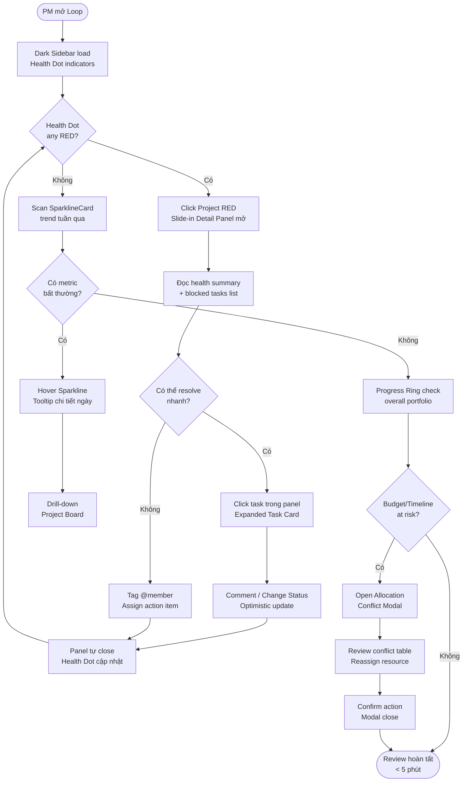
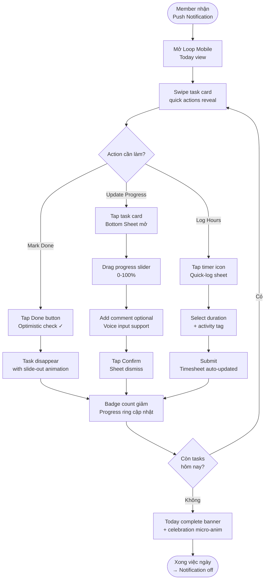
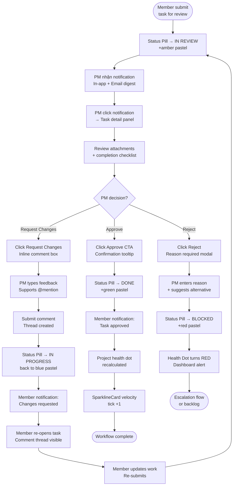

# UX Design Specification — Loop

**Author:** Tuan Anh
**Date:** 2026-05-26

---

<!-- UX design content will be appended sequentially through collaborative workflow steps -->

## Executive Summary

### Project Vision

Loop là hệ thống quản lý dự án nội bộ thay thế Excel — tích hợp quản lý nhân sự, task, chi phí và cảnh báo trong một nền tảng duy nhất. Dữ liệu phân quyền theo cơ cấu tổ chức. Triển khai on-premise, không phụ thuộc internet.

Revision 2 hướng đến giao diện có tính thẩm mỹ cao hơn, hiện đại hơn — lấy cảm hứng từ Linear, Plane.so và Vercel Dashboard — nhưng giữ nguyên toàn bộ logic nghiệp vụ đã thiết kế.

### Target Users

| Người dùng | Tần suất | Nhu cầu UX chính | Nền tảng |
|---|---|---|---|
| **Admin** | Thỉnh thoảng | Quản lý org tree, nhân sự, phân quyền | Web |
| **PM** | Hàng ngày | Dự án, task, allocation, cost, cảnh báo | Web |
| **Member** | Hàng ngày | Xem & update task cá nhân | Mobile + Web |
| **Leadership** | Định kỳ | Dashboard tổng quan, xuất báo cáo | Web |

### Key Design Challenges

1. **Data density vs. clarity** — Loop hiển thị nhiều số liệu cùng lúc; bản mới phải tổ chức hierarchy tốt hơn để user không overwhelmed mà vẫn đủ thông tin
2. **Allocation conflict UI** — Visual mạnh hơn, không chỉ dạng bảng số
3. **Task tree 5 cấp** — Navigation không bị lạc; progress roll-up hiển thị trực quan hơn bằng mini progress arc
4. **Dark sidebar + light content** — Đảm bảo contrast và accessibility khi mixing hai nền độ sáng khác nhau

### Design Opportunities

1. **Dark sidebar làm điểm nhận diện** — Tạo cảm giác premium, phân biệt rõ navigation vs. content
2. **Sparkline mini chart trên metric card** — Leadership đọc trend nhanh không cần vào chart riêng
3. **Progress ring thay progress bar** — Compact hơn, đẹp hơn trên dashboard dense-data
4. **Micro-animations** — Transition khi update progress, khi badge count giảm → tăng cảm giác "alive" và instant feedback

---

## Core User Experience

### Defining Experience

Defining experience của Loop Revision 2:
**"PM mở app — biết ngay tình trạng toàn bộ dự án trong 15 giây."**

Giảm từ 30 giây (Revision 1) xuống 15 giây nhờ:
- Dark sidebar luôn hiện project list với health indicator màu sắc
- Metric cards với sparkline — trend hiện ra không cần click vào chart
- Progress ring thay thế progress bar — đọc % hoàn thành nhanh hơn

Defining experience này CHỈ hoạt động nếu Members cập nhật tiến độ thường xuyên — hai luồng cốt lõi song song vẫn được giữ nguyên.

### Platform Strategy

| Platform | Target | Approach |
|---|---|---|
| **Web ≥ 1280px** | Admin, PM, Leadership | Full-feature — dark sidebar + main content + slide panel |
| **Web 768–1279px** | PM laptop nhỏ | Sidebar icon-only (56px); table ẩn secondary columns |
| **Mobile iOS/Android** | Member (chính), PM (cảnh báo) | Native Expo app — touch-first, tối giản tuyệt đối |

Không cần offline mode. Web app hiển thị banner chuyển hướng sang mobile app nếu viewport < 576px.

### Effortless Interactions

- **Member update % tiến độ:** ≤ 3 thao tác từ khi mở mobile — danh sách task → tap → kéo slider → Save tự động
- **PM duyệt task:** Đủ context trong 1 màn hình, không navigate đi nơi khác; slide panel từ phải không mất context list
- **Leadership xem dashboard:** Không cần đăng nhập thường xuyên — sparkline trên metric card cho thấy trend 7 ngày qua tức thì
- **PM thêm người vào dự án:** Rate pre-fill từ hồ sơ nhân sự, conflict warning nổi bật ngay khi blur khỏi field ngày

### Critical Success Moments

- **PM lần đầu xem dashboard mới:** Dark sidebar + progress rings + sparklines → "Tôi thấy rõ mọi thứ hơn bản cũ nhiều"
- **Member update task trên mobile:** Slider mượt, auto-save, confetti micro-animation khi Done → "Nhanh, xong, không cần nghĩ"
- **Allocation conflict hiển thị:** Timeline visual với màu đỏ rõ ràng thay bảng số → PM tin tưởng dữ liệu ngay lập tức
- **Leadership export báo cáo:** 2 click, file Excel sạch → thay hoàn toàn việc làm báo cáo thủ công

### Experience Principles

1. **Thấy trước, làm sau** — Dark sidebar + health indicator cho biết vấn đề trước khi user phải click vào bất kỳ đâu
2. **Mobile = một việc, làm thật tốt** — Mobile chỉ: update task và xem cảnh báo; không cố nhét tính năng web vào màn hình nhỏ
3. **Cảnh báo dẫn đường, không chặn** — Conflict và warning luôn đi kèm hướng giải quyết cụ thể và cho phép override có ý thức
4. **Tiến độ hiển thị ở mọi nơi** — Progress roll-up luôn visible ở sidebar, card, list — không cần drill-down để biết trạng thái

---

## Desired Emotional Response

### Primary Emotional Goals

Primary: **"Tôi kiểm soát được mọi thứ"** — Confidence và clarity. Loop thay thế Excel vốn gây lo lắng về độ chính xác. Mọi số liệu phải có thể verify, mọi vấn đề phải có hướng giải quyết rõ ràng.

Với Revision 2, thêm một lớp cảm xúc mới: **"Đây là công cụ tôi tự hào dùng"** — Cảm giác premium khi nhìn vào dark sidebar và clean layout; không còn cảm giác "phần mềm nội bộ chắp vá" nữa.

Secondary: **Efficiency** — "Nhanh hơn nhiều so với trước"
Supporting: **Trust** — "Số liệu này tôi có thể dùng để báo cáo ngay"
Bonus: **Pride** — "Tool của mình đẹp hơn Jira"

### Emotional Journey Mapping

| Thời điểm | Cảm xúc mong muốn |
|---|---|
| **Lần đầu mở Loop mới** | "Wow — đây không giống phần mềm nội bộ bình thường" |
| **PM hàng ngày** | "Tôi thấy tổng quan ngay — biết cần làm gì không cần tìm kiếm" |
| **Member hàng ngày** | "Nhanh, xong, tiếp tục làm việc thực sự" |
| **Khi có conflict/lỗi** | "Tôi biết chính xác vấn đề ở đâu và cách sửa ngay" |
| **Leadership xem dashboard** | "Tôi có thể present số liệu này ngay bây giờ" |
| **Sau 1 tuần dùng** | "Tôi không muốn quay lại Excel nữa" |

### Micro-Emotions

- **Tin tưởng:** Sparkline cho thấy trend — không chỉ snapshot, user thấy dữ liệu "sống" và được update liên tục
- **Nhẹ nhõm:** Dark sidebar hiện health indicator xanh — "Mọi dự án đang ổn, tôi không cần lo"
- **Thỏa mãn:** Micro-animation khi task Done — progress ring điền đầy với transition mượt, confetti nhẹ
- **Tự tin:** Allocation conflict timeline rõ ràng → PM ra quyết định mà không cần verify lại ở chỗ khác
- **Hào hứng khi onboard:** First impression với dark sidebar premium tạo kỳ vọng cao — user muốn khám phá thêm

### Emotions to Avoid

- **Overwhelm:** Quá nhiều widget, số liệu cạnh tranh nhau → Giải pháp: hierarchy rõ, progressive disclosure
- **Confusion:** Không biết task đang ở trạng thái nào → Giải pháp: status pill badge màu nhất quán ở mọi nơi
- **Lo lắng về độ chính xác:** User nghi ngờ số liệu → Giải pháp: tooltip nguồn gốc số liệu khi hover
- **Cảm giác "phần mềm cũ":** Legacy enterprise look → Giải pháp: dark sidebar + indigo accent + border-radius 8px

### Design Implications

| Cảm xúc | UX Approach |
|---|---|
| **Confidence** | Health indicator màu trên sidebar project list — thấy ngay không cần click |
| **Trust** | Sparkline 7 ngày trên metric card — trend rõ ràng, không chỉ số tĩnh |
| **Efficiency** | Auto-save trên mobile — không cần nhấn Save; progress cập nhật ngay |
| **Pride** | Dark sidebar `#0F172A` + indigo `#4F46E5` — visual identity premium |
| **Calm** | Generous whitespace trong content area — thở được dù nhiều data |
| **Relief** | Badge count = 0 → icon notification ẩn badge hoàn toàn, không cần nhìn |

---

## UX Pattern Analysis & Inspiration

### Inspiring Products Analysis

**Linear** — chuẩn mực của modern project management UI (2024–2025)

Điểm mạnh về UX:
- Dark sidebar với project/team list — navigation context luôn hiện, không bao giờ lạc
- Keyboard-first: mọi action đều có shortcut, cmd+K command palette
- Tốc độ: transition < 100ms, không có loading spinner — cảm giác "instant" dù là web app
- Typography lớn, generous whitespace — dễ đọc dù nhiều data
- Status pills màu pastel, không border — hiện đại, không nặng nề

Học gì cho Loop: Dark sidebar navigation pattern, status pill system (không dùng Tag của Ant Design default), transition animation philosophy: nhanh, purposeful.

---

**Vercel Dashboard** — enterprise metrics display đẹp nhất hiện tại

Điểm mạnh về UX:
- Metric cards với mini sparkline — trend 7 ngày hiện ngay
- Màu semantic nhất quán: xanh = healthy, đỏ = error, vàng = warning
- Dark mode first-class citizen — không phải afterthought
- Empty states đẹp với illustration nhẹ và CTA rõ ràng
- Table rows hover subtle — feedback mà không gây distraction

Học gì cho Loop: Sparkline pattern cho metric cards, semantic color philosophy, dark mode implementation methodology.

---

**Plane.so** — open-source, use case gần nhất với Loop

Điểm mạnh về UX:
- Multiple view: List / Board / Gantt — cùng data, nhiều cách nhìn
- Breadcrumb navigation trong task hierarchy rõ ràng
- Issue detail slide-in từ phải — giữ context danh sách
- Filter + Group by inline — không cần modal riêng

Học gì cho Loop: Slide-in detail panel, breadcrumb cho task tree 5 cấp, inline filter bar pattern.

---

**Jira** — công cụ users đang dùng hàng ngày (familiar baseline)

Điểm mạnh: Status badge màu, assignee avatar trên task row, quick filter.
Điểm yếu để làm ngược lại: Mobile experience tệ, quá nhiều options, loading chậm.

### Transferable UX Patterns

**Navigation:**
- Dark sidebar 56px icon-only mặc định (Linear) — expand khi hover hoặc pin; active item: indigo `#4F46E5` background + icon trắng
- Breadcrumb trail: `Dự án > L1 > L2 > Task` — click item cha navigate về đúng level
- Tab navigation URL-synced trong Project detail page

**Interaction:**
- Slide-in detail panel 480px từ phải — click row mở panel, không mất context list
- Inline filter bar trên table — không dùng dropdown modal riêng
- Optimistic update: UI cập nhật ngay, sync background

**Visual:**
- Status pill badge: rounded-full, background màu nhạt + text màu đậm (không phải border Tag)
- Metric card với sparkline mini 7 ngày thay Statistic đơn thuần
- Progress ring (donut chart nhỏ) thay progress bar trên dashboard
- Subtle row hover: `#F8FAFC` → `#F1F5F9`
- Assignee avatar 24px trên task row

### Anti-Patterns to Avoid

- **Jira mobile complexity:** Loop mobile chỉ 2 việc — không copy Jira mobile navigation
- **Full-page loading spinner:** Luôn dùng skeleton screen hoặc optimistic update
- **Modal trên Modal:** Dùng Drawer cho context thứ 2 — không stack modal
- **Ant Design default styling:** Override toàn bộ token — tránh cảm giác "generic Ant Design"
- **Too many visible actions:** Ẩn secondary actions vào `...` menu — chỉ primary action visible
- **Sprint/Scrum concepts:** Loop không cần agile framework

### Design Inspiration Strategy

**Adopt trực tiếp:**
- Dark sidebar navigation (Linear)
- Sparkline trên metric card (Vercel)
- Slide-in detail panel từ phải (Plane.so)
- Status pill badge system (Linear)
- Breadcrumb cho task hierarchy (Plane.so)

**Adapt:**
- Keyboard shortcuts: chỉ implement những gì PM dùng hàng ngày
- Progress visualization: ring cho dashboard, linear bar cho task list
- Filter bar: đơn giản hóa — chỉ 3 filter: Trạng thái / Người được giao / Hạn

**Không dùng:**
- Full Jira navigation structure
- Scrum board / Sprint view
- Story points (Loop dùng man-hour)
- Offline mode

---

## Design System Foundation

### Design System Choice

- **Web:** Ant Design v5 (React 19) — giữ nguyên nhưng override sâu hơn
- **Mobile:** React Native Paper + Expo SDK (giữ nguyên)
- **Charts:** Recharts cho sparkline + AntV/G2 cho chart phức tạp

### Rationale for Selection

Ant Design v5 vẫn là lựa chọn đúng — components enterprise-grade, accessibility tốt, AI code generation quality cao nhất. Revision 2 không đổi design system mà đổi cách **sử dụng** design system: override token sâu hơn, thay thế một số component mặc định bằng custom, dark sidebar nằm ngoài Ant Design's Sider component.

Bài học từ Revision 1: Ant Design default styling quá dễ nhận ra. Revision 2 sẽ override đủ để không ai nhận ra đây là Ant Design.

### Implementation Approach

**Token Override Strategy:**
```json
{
  "token": {
    "colorPrimary": "#4F46E5",
    "colorSuccess": "#10B981",
    "colorWarning": "#F59E0B",
    "colorError": "#EF4444",
    "borderRadius": 8,
    "borderRadiusLG": 12,
    "fontFamily": "'Inter', -apple-system, sans-serif",
    "fontSize": 14,
    "colorBgContainer": "#FFFFFF",
    "colorBgLayout": "#F8FAFC",
    "colorBorder": "#E2E8F0",
    "boxShadow": "0 1px 3px rgba(0,0,0,0.08), 0 1px 2px rgba(0,0,0,0.04)"
  }
}
```

**Dark Sidebar (ngoài Ant Design token system):**
- Build bằng CSS-in-JS với màu `#0F172A` (Slate 900)
- Không dùng Ant Design `<Layout.Sider>` mặc định
- Icon library: Lucide React (consistent stroke 1.5px, tree-shakeable)

**Components cần custom (không dùng Ant Design default):**
- `StatusPill` — thay `<Tag>`: pill shape, background tint, no border
- `SparklineCard` — thay `<Statistic>`: metric + mini sparkline 7 ngày
- `ProgressRing` — thay `<Progress type="circle">`: nhỏ hơn, dùng cho dashboard
- `DarkSidebar` — hoàn toàn custom, không phải Ant Design Sider

### Customization Strategy

**Status Colors (Revision 2 — softer, more modern):**

| Trạng thái | Background | Text | Hex BG | Hex Text |
|---|---|---|---|---|
| To Do | Slate nhạt | Slate đậm | `#F1F5F9` | `#475569` |
| In Progress | Indigo nhạt | Indigo đậm | `#EEF2FF` | `#4338CA` |
| Done | Emerald nhạt | Emerald đậm | `#ECFDF5` | `#065F46` |
| Chờ duyệt | Amber nhạt | Amber đậm | `#FFFBEB` | `#92400E` |
| Trả lại | Red nhạt | Red đậm | `#FEF2F2` | `#991B1B` |
| Huỷ | Gray nhạt | Gray đậm | `#F9FAFB` | `#374151` |

Màu pastel nhạt thay màu solid đậm — dễ nhìn hơn khi nhiều badge cùng lúc.

**Mobile (React Native Paper):**
- Giữ nguyên stack, cập nhật theme colors sang bộ màu mới
- Dynamic color scheme sync với `useColorScheme()` hook

---

## Design Direction Decision

### Design Directions Explored

Một hướng duy nhất được phát triển và đánh giá — **Modern Clean Enterprise** — thay vì nhiều hướng cạnh tranh nhau. Quyết định này có chủ ý: với context của Loop (internal tool, daily users, data-heavy), không có giá trị trong việc thử nghiệm hướng hoàn toàn khác biệt về triết lý.

HTML showcase tại: `_bmad-output/planning-artifacts/ux-design-directions.html`

Showcase bao gồm 4 màn hình key:
1. **Dashboard PM** — Dark sidebar expanded + SparklineCards + progress rings + alerts panel
2. **Project Tasks** — Dark sidebar collapsed + task tree + slide-in detail panel + approval actions
3. **Mobile Member** — My Tasks list + Task detail bottom sheet với progress slider
4. **Allocation Conflict Modal** — Warning overlay với conflict timeline table

### Chosen Direction

**Modern Clean Enterprise** — confirmed sau khi review showcase.

Key visual decisions được implement trong HTML:
- Dark sidebar `#0F172A` với project health dots màu sắc
- Indigo `#4F46E5` làm accent color duy nhất
- SparklineCard với SVG gradient sparkline thay Statistic đơn thuần
- Progress ring (SVG donut) cho project health
- Status pills rounded-full với background tint — không phải Tag mặc định
- Slide-in detail panel 340px từ phải
- Subtle elevation (`box-shadow`) thay border

### Design Rationale

- **Dark sidebar**: Tạo phân tách rõ ràng navigation/content, cảm giác premium
- **Indigo thay Corporate Blue**: Modern, distinctive, không "legacy enterprise"
- **Sparkline**: Trend trong 7 ngày hiện ngay — leadership không cần click thêm
- **Progress ring**: Compact hơn progress bar, đọc % nhanh hơn khi scan nhiều project
- **Pill badges**: Softer màu pastel — dễ nhìn khi nhiều badge trên màn hình

### Implementation Approach

Ant Design v5 với token override sâu + custom components:
- `DarkSidebar` (custom, không phải `Layout.Sider`)
- `SparklineCard` (custom wrapping `Statistic` + Recharts sparkline)
- `ProgressRing` (SVG donut, không phải `Progress type="circle"`)
- `StatusPill` (custom `span` với CSS, không phải `Tag`)
- Tất cả Ant Design components dùng token `colorPrimary: #4F46E5`

---

## Core User Interaction

### Defining Experience

Loop có hai defining experience song song — thiếu một trong hai, hệ thống mất dữ liệu hoặc mất người dùng:

**Luồng 1 — PM:** "Mở app, biết ngay tình trạng mọi thứ trong 15 giây, xử lý việc cần làm mà không cần navigate đi đâu cả."

**Luồng 2 — Member:** "Cập nhật tiến độ task trong 3 tap, không cần nghĩ, không cần điền form."

Nếu chỉ nail được một — chọn Luồng 2. Data từ Members là nhiên liệu cho mọi thứ: dashboard PM, alert engine, cost calculation.

### User Mental Model

**Từ (Excel):** Mỗi dự án = 1 file riêng, tính toán thủ công, hỏi qua email/Zalo để lấy update, không có real-time, báo cáo = copy-paste từ nhiều file vào 1 file master mỗi tuần.

**Sang (Loop):** Data tự chảy từ task → dự án → dashboard. Alert tự đến khi có vấn đề. Một nguồn dữ liệu duy nhất, không cần hỏi ai.

**Điểm chuyển đổi tâm lý quan trọng nhất:** PM lần đầu thấy progress dự án cập nhật ngay sau khi Member save task — không cần F5, không cần hỏi — đó là moment "à hóa ra dữ liệu tự đi được".

### Success Criteria

- **PM:** Từ lúc mở app → biết dự án nào cần xử lý: ≤ 15 giây
- **PM:** Xử lý hết approval queue buổi sáng: ≤ 5 phút
- **Member:** Từ mở mobile app → save progress update: ≤ 3 thao tác
- **Leadership:** Đọc tình trạng toàn bộ dự án: ≤ 60 giây
- **Độ tin cậy:** User không cần verify lại số liệu ở nơi khác

### Novel vs. Established Patterns

**Established (adapted):** Task list view, status badge colors, slide-in detail panel, breadcrumb navigation, assignee avatar, inline filter bar — tất cả đều là patterns user đã biết từ Jira.

**Loop-specific (novel):**
- Dark sidebar với project health indicator — không cần click vào project để biết tình trạng
- Allocation conflict timeline visual — không phải bảng số
- Progress roll-up real-time khi child task update
- SparklineCard — metric + trend trong 1 component compact

**Teaching strategy cho novel patterns:** Tooltip lần đầu trên dark sidebar health indicator ("Màu xanh = dự án on-track"). Sau 3 ngày dùng, tooltip tự tắt. Không cần onboarding tour dài.

### Experience Mechanics

**Luồng PM — Daily Dashboard Review:**

| Bước | Hành động | Phản hồi hệ thống |
|---|---|---|
| Initiation | Mở Loop → trang Dashboard | Dark sidebar hiện project list với health dot màu; metric cards load với skeleton → data |
| Scan | Mắt quét sidebar: dot đỏ = có vấn đề | Health dot `#EF4444` + count badge nhỏ trên project name |
| Interaction | Click project có dot đỏ → Dashboard project | SparklineCard hiện trend, alert badge đếm số lượng |
| Drill-down | Click alert → Slide-in panel từ phải | Panel hiện task detail + action buttons: Duyệt / Trả lại / Huỷ |
| Action | Click Duyệt | Badge count giảm với animation; task disappear khỏi queue |
| Completion | Alert count = 0, approval queue = 0 | Dot sidebar chuyển xanh; notification bell ẩn badge |

**Luồng Member — Mobile Progress Update:**

| Bước | Hành động | Phản hồi hệ thống |
|---|---|---|
| Initiation | Mở mobile app | My Tasks screen; task gần deadline nổi bật ở top |
| Tap | Tap vào task | Task detail screen slide up |
| Update | Kéo progress slider 0–100% | Số % cập nhật real-time khi kéo |
| Save | Release slider → auto-save | Checkmark animation; progress bar cập nhật; nếu 100% → confetti nhẹ |
| Return | Swipe down về My Tasks | Task đã Done mờ đi, chuyển xuống Completed section |

---

## Visual Design Foundation

### Color System

**Primary Palette:**
```
Indigo 600:  #4F46E5  ← primary buttons, links, active states
Indigo 50:   #EEF2FF  ← hover backgrounds, selected rows
Indigo 700:  #4338CA  ← pressed states, dark text on light bg
```

**Sidebar Palette:**
```
Slate 900:   #0F172A  ← sidebar background
Slate 700:   #334155  ← sidebar item hover
Slate 400:   #94A3B8  ← sidebar icon inactive
White:       #FFFFFF  ← sidebar icon active, sidebar text
```

**Semantic Colors:**
```
Success:   #10B981  (Emerald 500)  ← Done, on-track, healthy
Warning:   #F59E0B  (Amber 500)   ← Chờ duyệt, near deadline
Danger:    #EF4444  (Red 500)     ← Trả lại, overdue, over budget
Info:      #4F46E5  (Indigo 600)  ← In Progress, neutral info
Neutral:   #6B7280  (Gray 500)    ← To Do, cancelled, disabled
```

**Surface Colors:**
```
Page bg:       #F8FAFC  ← Slate 50
Card/Panel:    #FFFFFF
Border:        #E2E8F0  ← Slate 200
Text Primary:  #0F172A  ← Slate 900
Text Secondary:#475569  ← Slate 600
Text Disabled: #94A3B8  ← Slate 400
```

**Dark Mode Surface:**
```
Page bg:       #0F172A  ← Slate 900
Card/Panel:    #1E293B  ← Slate 800
Border:        #334155  ← Slate 700
Text Primary:  #F1F5F9  ← Slate 100
Text Secondary:#94A3B8  ← Slate 400
```

### Typography System

Font: `"Inter", -apple-system, BlinkMacSystemFont, sans-serif`

```
Display:  28px / 700 / line-height 36px  ← page hero numbers
H1:       24px / 600 / line-height 32px  ← page titles
H2:       20px / 600 / line-height 28px  ← section headers
H3:       16px / 600 / line-height 24px  ← card titles
Body:     15px / 400 / line-height 24px  ← table content, descriptions
Small:    13px / 400 / line-height 20px  ← labels, timestamps
Code:     13px / 400 / font: "JetBrains Mono"  ← rate values, IDs
```

### Spacing & Layout Foundation

Base unit: 4px | Scale: `4 / 8 / 12 / 16 / 24 / 32 / 48 / 64px`

```
Card padding:        20px
Section gap:         24px
Sidebar collapsed:   56px (icon-only default)
Sidebar expanded:    220px (hover or pinned)
Top nav height:      56px
Slide panel width:   480px
Content max-width:   1440px
```

**Elevation System:**
```
Level 1 — card:    0 1px 3px rgba(0,0,0,0.08)
Level 2 — popover: 0 4px 12px rgba(0,0,0,0.12)
Level 3 — modal:   0 8px 32px rgba(0,0,0,0.16)
Level 4 — sidebar: 2px 0 8px rgba(0,0,0,0.12)
```

**Border Radius:**
```
sm: 4px  ← badges | md: 8px  ← cards, buttons (DEFAULT)
lg: 12px ← modals | full: 9999px ← status pills, avatars
```

### Accessibility Considerations

- Indigo `#4F46E5` trên white: **4.6:1** — WCAG AA ✅
- Indigo `#4338CA` (darker) trên white: **5.9:1** ✅
- Body text `#0F172A` trên white: **19.4:1** ✅
- Text Secondary `#475569` trên white: **5.7:1** ✅
- Status colors dùng icon + màu + label — không chỉ màu đơn thuần ✅
- Mobile touch targets: minimum **44×44px** ✅
- Dark sidebar text `#F1F5F9` trên `#0F172A`: **15.8:1** ✅

---

## User Journey Flows

### Journey 1: PM Daily Review Dashboard



### Journey 2: Member Progress Update (Mobile)



### Journey 3: Task Approval Workflow



### Journey 4: PM Load Employee with Allocation Conflict

```mermaid
flowchart TD
    A([PM lên kế hoạch\ndự án mới]) --> B[Mở Resource Allocation\npage]
    B --> C[Drag member vào\nproject timeline]
    C --> D{Conflict detection\nreal-time}
    D -- "No conflict" --> E[Allocation saved\nCalendar block shown]
    D -- "Conflict detected" --> F[Allocation Conflict Modal\nmở tự động]
    F --> G[Modal hiển thị:\nConflict table 3 cột]
    G --> H[Member | Project A % | Project B %\nRow highlight RED nếu >100%]
    H --> I{PM review options}
    I -- "Adjust % current project" --> J[Inline edit % field\nLive recalculation]
    J --> K{Total <= 100%?}
    K -- Còn conflict --> J
    K -- OK --> L[Confirm Changes\nModal close]
    I -- "Move dates timeline" --> M[Open mini Gantt\nwithin modal]
    M --> N[Drag timeline blocks\nAuto-recalculate]
    N --> K
    I -- "Find alternative member" --> O[Search member field\nSkill filter]
    O --> P[Availability heatmap\ncolor-coded]
    P --> Q[Select replacement\nmember]
    Q --> L
    I -- "Ignore & force" --> R[Override confirmation\n+ risk warning banner]
    R --> S{PM confirms?}
    S -- Có --> L
    S -- Không --> I
    L --> T[Resource timeline updated\nAll affected projects notified]
    T --> U([Allocation saved\nHealth dots recalculate])
    E --> U
```

### Journey Patterns

**Pattern 1 — Health Signal Hierarchy**: Mọi journey bắt đầu từ hoặc kết thúc bằng việc cập nhật Health Dot → Sparkline → Progress Ring theo cascade. Signal chảy top-down từ indicator → detail → action.

**Pattern 2 — Slide-in Panel as Triage**: PM không cần navigate away để triage. Panel đủ context cho 80% quyết định nhanh. Chỉ drill-down khi cần viết nhiều hoặc reassign.

**Pattern 3 — Optimistic Updates**: Status changes phản ánh ngay (Pill color change trước khi server confirm). Error state rollback chỉ khi API thực sự fail.

**Pattern 4 — Mobile-first Progress Capture**: Member interaction tối ưu cho 1 tay, 30 giây. Bottom Sheet + Slider thay Text Input. Voice option cho comment.

**Pattern 5 — Conflict Prevention > Resolution**: Allocation conflict modal trigger ngay khi drag (prevention), không đợi save (correction). Real-time feedback loop.

---

## Component Strategy

### Design System Components

Ant Design v5 là foundation — không replace, chỉ override token và extend với custom components khi cần.

**Dùng trực tiếp (token override `colorPrimary: #4F46E5`):**

| Component | Use Case |
|---|---|
| `Button` | Tất cả CTA, primary/secondary/ghost variants |
| `Table` | Task list, resource allocation grid |
| `Modal` | Reject reason, confirmation dialogs |
| `Form` / `Input` / `Select` | Task editing, project creation |
| `Dropdown` | Quick actions menu, filter options |
| `Tooltip` | Icon labels, sparkline hover data |
| `Avatar` / `Avatar.Group` | Member assignment, team display |
| `Badge` | Notification count, unread indicators |
| `Tabs` | Project board views (Kanban/List/Gantt) |
| `Skeleton` | Loading states cho toàn bộ cards |
| `notification` / `message` | Toast alerts, optimistic update feedback |
| `Empty` | No data states với custom illustration |

**Override sâu hoặc replace:**

| Ant Design | Vấn đề | Giải pháp |
|---|---|---|
| `Tag` | Quá generic, không fit pastel scheme | Replace → `StatusPill` custom |
| `Statistic` | Không có trend line | Replace → `SparklineCard` custom |
| `Layout.Sider` | Light theme mặc định | Replace → `DarkSidebar` custom |
| `Progress type="circle"` | Quá flat, không đủ impact | Replace → `ProgressRing` custom SVG |

### Custom Components

#### DarkSidebar

**Purpose:** Navigation chính, luôn visible, cung cấp overview health toàn portfolio.

**Anatomy:** Logo zone (56px) → Nav items (icon + label) → Project health list → User menu (bottom)

**States:**
- `expanded` 220px — label visible, hover bg `#1E293B`
- `collapsed` 56px — icon only, tooltip on hover
- `nav-item-active` — left border `#4F46E5 4px` + bg `#1E293B`
- Health dot: `green #10B981` | `amber #F59E0B` | `red #EF4444`

**Accessibility:** `role="navigation"`, `aria-label="Main navigation"`, keyboard `Tab` + `Enter`

#### SparklineCard

**Purpose:** Metric số + trend 7 ngày trong 1 card compact.

**Anatomy:** Label → Metric value (2xl bold) → Delta badge (↑/↓ %) → Sparkline SVG (64px height)

**Variants:** `variant="bar"` (velocity, count) | `variant="line"` (budget burn, hours)

**States:** `loading` Skeleton | `positive-trend` `#10B981` | `negative-trend` `#EF4444` | `neutral` `#6B7280`

**Hover:** Tooltip value từng ngày

**Accessibility:** `aria-label="[metric] [value], trend [+/-X%] over 7 days"`

#### StatusPill

**Purpose:** Hiển thị task/project status — thay `Tag`.

**Anatomy:** `span` `border-radius: 9999px`, padding `4px 10px`, pastel background + dark text semantic.

**Variants:** `todo` | `in-progress` | `in-review` | `done` | `blocked` | `cancelled`

**Accessibility:** `role="status"`, `aria-label="Status: [value]"`

#### ProgressRing

**Purpose:** Overall completion % — thay `Progress type="circle"`.

**Anatomy:** SVG donut, stroke-width 8px, center text `%`.

**Variants:** `size="sm"` 48px | `size="md"` 80px (default) | `size="lg"` 120px

**Color:** `< 33%` → red | `33–66%` → amber | `> 66%` → green

**Accessibility:** `role="progressbar"`, `aria-valuenow`, `aria-valuemin="0"`, `aria-valuemax="100"`

#### SlidePanel

**Purpose:** Detail view overlay từ phải — triage không cần full navigation.

**Anatomy:** Header (title + StatusPill + close) → Content scroll area → Action footer

**States:** `closed` `translateX(100%)` | `open` `translateX(0) 300ms ease-out` | backdrop `rgba(0,0,0,0.3)`

**Accessibility:** `role="dialog"`, `aria-modal="true"`, focus trap, `Esc` để close

#### AllocationConflictModal

**Purpose:** Hiển thị và resolve resource conflict khi assign member.

**Anatomy:** Warning header → Conflict summary → Conflict table → Resolution tabs (Adjust % / Move Dates / Find Alternative) → Confirm/Cancel

**States:** `row-conflict` bg `#FEF2F2` red text | `row-resolved` bg `#ECFDF5` green text

### Component Implementation Strategy

- Custom components xây bằng Ant Design tokens — không import Tailwind để tránh conflict
- Mỗi custom component có TypeScript interface riêng, export từ `src/components/ui/`
- Storybook story cho mỗi component với tất cả variants và states
- Unit test coverage cho logic (state transitions, accessibility attributes)
- Recharts cho sparklines (nhẹ, composable), AntV/G2 chỉ cho complex charts

### Implementation Roadmap

**Phase 1 — Core Navigation & Data Display** *(Sprint 1–2)*
- `DarkSidebar` — blocking tất cả screens
- `StatusPill` — xuất hiện trong mọi task list
- `SparklineCard` — Dashboard PM không render thiếu

**Phase 2 — Interaction Components** *(Sprint 3–4)*
- `SlidePanel` — PM triage flow, Task Approval journey
- `ProgressRing` — Dashboard + Project header
- `AllocationConflictModal` — Resource Allocation feature

**Phase 3 — Mobile Components** *(Sprint 5)*
- Mobile Task Bottom Sheet (React Native Paper + custom)
- Mobile Swipe Actions (react-native-gesture-handler)
- Quick-log Timer Sheet

---

## UX Consistency Patterns

### Button Hierarchy

Loop có nhiều action contexts — rule rõ ràng giúp user luôn biết action nào quan trọng nhất.

| Variant | Khi nào dùng | Style |
|---|---|---|
| **Primary** | 1 per section — "Tạo Task", "Phê duyệt", "Lưu" | Solid `#4F46E5` |
| **Secondary** | "Chỉnh sửa", "Xem chi tiết", "Export" | Ghost/outline `#4F46E5` |
| **Danger** | "Từ chối", "Xoá", "Force override" | Solid `#EF4444` |
| **Ghost / Link** | "Xem tất cả", inline table actions | No border, text `#4F46E5` |

**Rules:**
- Không bao giờ có 2 Primary button cạnh nhau
- Modal/Panel footer: Primary (Confirm) bên phải, Secondary/Ghost (Cancel) bên trái
- Danger button chỉ xuất hiện sau khi user đã initiate destructive flow — không hiện ngay từ đầu

### Feedback Patterns

**Toast (Ant Design `message` API):**
- Success `#10B981`: "Đã lưu thành công" — tự dismiss sau 3s
- Error `#EF4444`: message cụ thể — không tự dismiss, user phải close
- Warning `#F59E0B`: tự dismiss sau 5s
- Loading: spinner + "Đang xử lý..." — dismiss khi API resolve

**Optimistic Update:**
- Status change phản ánh ngay (UI trước API)
- Nếu API fail: rollback + toast error với action button "Thử lại"
- Pending visual cue: opacity 0.7 + spinner nhỏ ở góc component

**In-line Validation:**
- Error message xuất hiện dưới field khi `onBlur`, không phải khi đang gõ
- Border field: `#EF4444` khi error, `#10B981` khi valid
- Required fields: `*` đỏ trong label — không dùng placeholder làm label

### Form Patterns

**Inline Edit (Task fields trong SlidePanel):**
- Fields hiển thị như text thường — show input state khi click
- Tab order: Title → Assignee → Due Date → Priority → Status → Description
- Auto-save draft mỗi 30s với indicator "Đã lưu bản nháp lúc HH:mm"
- Submit shortcut: `Cmd/Ctrl + Enter`

**Confirmation Pattern:**
- Destructive (Xoá, Từ chối): Modal confirm với Danger button + reason input
- Non-destructive nhỏ: Tooltip confirm ("Click để xác nhận")
- Bulk actions: Banner confirm ở top với count ("Bạn đang cập nhật 12 tasks")

**Submit với lỗi:**
- Highlight tất cả empty required fields khi click Submit
- Scroll to first error tự động
- Submit button label: "Lưu (3 lỗi cần sửa)"

### Navigation Patterns

**Sidebar:**
- Active: left border `#4F46E5 4px` + bg `#1E293B`
- Hover: bg `#1E293B`, transition 150ms
- Click project name → navigate đến Project Board
- Click health dot → mở SlidePanel với project health detail

**Breadcrumb:**
- Format: `Portfolio > [Project Name] > Tasks`
- Clickable trừ last item (current page)
- Mobile: chỉ hiện parent level `← [Project Name]`

**Panel/Modal dismiss:**
- SlidePanel: `×` button, click backdrop, `Esc`
- Modal: `Esc` + Cancel button + click backdrop
- Destructive confirm modal: chỉ Cancel button (không close bằng backdrop/Esc)

### Loading & Empty States

**Loading:**
- Page load: Skeleton layout giữ structure — không spinner toàn trang
- Table/List: 3 Skeleton rows với animated shimmer
- Card: Skeleton shape đúng dimensions
- Chart/metric: Skeleton tương ứng hình dạng

**Empty States:**
- No data: illustration nhỏ + headline + CTA — "Chưa có task nào. [+ Tạo task đầu tiên]"
- No search results: text + link — "Không tìm thấy kết quả. [Xoá bộ lọc]"
- API error trong card: "Không tải được dữ liệu [Thử lại]" — không crash toàn app

### Modal & Overlay Patterns

**Modal vs SlidePanel:**
- **Modal** — xác nhận ngắn, warning, form ≤ 4 fields, không cần xem context phía sau
- **SlidePanel** — detail view dài, form phức tạp, cần tham chiếu list phía sau

**Modal sizes:** `sm` 400px (confirm) | `md` 560px (form) | `lg` 720px (AllocationConflict)

**Backdrop:** Modal `rgba(0,0,0,0.3)` | SlidePanel `rgba(0,0,0,0.2)`

Tránh nested modal — redesign thành wizard steps nếu cần multi-step flow.

### Search & Filter Patterns

**Global Search:**
- Shortcut: `Cmd/Ctrl + K` → command palette
- Kết quả nhóm theo: Tasks / Projects / Members
- Keyboard: arrow keys navigate, `Enter` chọn, `Esc` đóng

**Table Filter:**
- Filter chips nằm trên table, mỗi chip có `×`
- "Xoá tất cả" khi có ≥ 2 chips active
- Filter state persist trong URL params (`?status=in-progress&assignee=123`)

**Sort:**
- Click header: ↑↓ (unsorted) → ↑ (asc) → ↓ (desc) → unsorted
- Sort state visible trong column header icon

---

## Responsive Design & Accessibility

### Responsive Strategy

Loop có 2 platform riêng biệt — strategy khác với responsive web thông thường.

**Desktop (Primary — PM & Admin):**
Web app trên 1280px–1920px. Layout tận dụng horizontal space:
- DarkSidebar expanded/collapsed với toggle
- 3-column layout: Sidebar (220px) | Main (flex) | SlidePanel (480px khi open)
- Dashboard: 4-column SparklineCard grid → 2-column ở 1280px

**Tablet (Secondary — PM khi di chuyển):**
- Web app, Sidebar auto-collapse về 56px (`< 1024px`)
- SlidePanel thay bằng full bottom sheet modal
- Touch targets min 44px, hover tooltips thay bằng tap-reveal

**Mobile Native (Primary — Member):**
- React Native app riêng biệt — không phải responsive web
- Bottom tab navigation thay sidebar
- Primary actions trong vùng thumb (bottom 40% màn hình)
- Task list → Bottom Sheet detail

### Breakpoint Strategy

Desktop-first vì primary users (PM) dùng desktop:

```
xl:  ≥ 1440px  — Full: sidebar 220px + main + panel
lg:  1024–1439px — Sidebar auto-collapse, panel over content
md:  768–1023px  — Tablet: sidebar hidden, hamburger trigger
sm:  < 768px     — Mobile web: minimal layout
```

**Grid:** 12-column, 24px gutters, max-width 1440px centered

Dashboard cards: `col-span-3` (xl) → `col-span-6` (lg) → `col-span-12` (md)

Breakpoint hook: Ant Design `useBreakpoint()` (`xs sm md lg xl xxl`)

### Accessibility Strategy

**Target: WCAG 2.1 Level AA**

**Contrast ratios (đã đảm bảo từ Visual Foundation):**

| Element | Ratio | Status |
|---|---|---|
| Body text `#0F172A` / white | 19.4:1 | ✅ AAA |
| Secondary text `#475569` / white | 5.7:1 | ✅ AA |
| Primary `#4F46E5` / white | 4.6:1 | ✅ AA |
| Sidebar text `#F1F5F9` / `#0F172A` | 15.8:1 | ✅ AAA |

**Keyboard Navigation:**
- Tất cả interactive elements reachable bằng `Tab`
- `Esc` đóng Modal/Panel, `Cmd/Ctrl + K` global search
- Arrow keys trong Dropdown, Select, Tabs
- Skip link "Chuyển đến nội dung chính" cho screen readers

**Screen Reader:**
- Semantic HTML: `<main>`, `<nav>`, `<header>`, `<aside>`, `<section>`
- ARIA roles cho custom components (theo spec trong Component Strategy)
- `aria-live="polite"` cho toast notifications
- `document.title` cập nhật khi navigate

**Focus Management:**
- Focus ring: `outline: 2px solid #4F46E5; outline-offset: 2px`
- Focus trap trong Modal và SlidePanel khi open
- Return focus về trigger element khi đóng

**Color Blindness:**
- Status luôn kèm icon + text label — không chỉ màu
- Health dots: màu + shape (●green / ▲amber / ✕red)

### Testing Strategy

**Responsive:**
- Chrome DevTools + BrowserStack (Chrome, Firefox, Safari, Edge)
- Real devices: iPhone SE, iPad, 13" MacBook, 27" iMac
- Mobile native: iOS Simulator + Android Emulator + 2 real devices

**Accessibility:**
- `axe-core` tích hợp Vitest test suite
- Lighthouse accessibility score ≥ 90 trong CI
- VoiceOver (macOS/iOS) manual testing cho 4 critical journeys
- Keyboard-only test tất cả journeys từ Step 10

**Performance targets:**
- FCP ≤ 1.5s (4G), LCP ≤ 2.5s, CLS ≤ 0.1

### Implementation Guidelines

**Responsive:**
- `rem` cho font sizes (base 16px, body 15px = `0.9375rem`)
- `%` và `flex`/`grid` cho layouts — không fixed pixel widths
- Desktop-first media queries: max-width 1023px (tablet), max-width 767px (mobile)

**Accessibility Web:**
- Semantic HTML + ARIA attributes ngay khi build component — không retrofit
- `eslint-plugin-jsx-a11y` bắt buộc trong ESLint config
- Storybook stories phải pass axe-core check

**Accessibility React Native:**
- `accessibilityLabel` bắt buộc cho tất cả touchable elements
- `accessibilityRole` và `accessibilityHint` cho complex interactions
- `minimumFontScale` không nhỏ hơn 0.85 (respect system font size)
- Test với iOS VoiceOver enabled trước mỗi release
